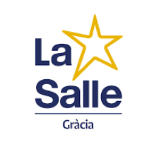
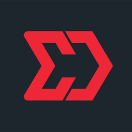

# 👋 Hi there!

I'm Adrià Sánchez Calvo, a software developer currently studying at La Salle Gràcia and working in EDYMA DIGITAL COMPANY.

## 🧑‍💻 About Me

- 🎓 Studying at La Salle Gràcia
- 📍 I'm from Barcelona.
- 💬 I can speak Catalan and Spanish.
- 💼 Working at EDYMA DIGITAL COMPANY 

 

## 📚 Projects

Here are some of the projects I've worked on:

- [GameOfLifeCW](https://github.com/Ninjakito/GameOfLifeCW.git): Repository made in Python about John Horton Conway's Game of Life.

## 📈 Stats

## 🛠 Skills

## 📞 Contact Me

You can reach me at:

Feel free to connect with me and explore my projects!
